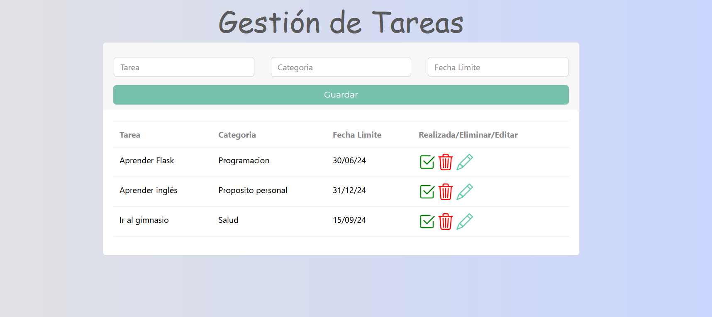

# ✅ Gestor de Tareas (Flask + SQLite)

Aplicación web desarrollada en **Python (Flask + SQLAlchemy)** para la gestión de tareas.  
Permite crear, editar, eliminar y marcar como realizadas las tareas, todo con persistencia en una base de datos **SQLite**.

---

## ✨ Funcionalidades

- ➕ **Añadir tareas** con categoría y fecha límite.  
- ✏️ **Editar tareas** (contenido, categoría y fecha).  
- 🗑️ **Eliminar tareas** de la lista.  
- ✅ **Marcar tareas como realizadas**.  
- 📋 Interfaz sencilla y organizada con **HTML + CSS**.  
- 💾 Persistencia en **SQLite** mediante **SQLAlchemy**.

---

### 🛠️ Tecnologías utilizadas

-  Python 3

- Flask 3.0.3

- SQLAlchemy 2.0.30

- SQLite

- HTML + CSS (Bootstrap)

---

#### 🚀 Instalación y uso

1. Clona este repositorio:
   git clone https://github.com/mpg2289/gestor-tareas.git
   cd gestor-tareas

2. Creacion y activación del entorno virtual

python -m venv venv

> En Windows
venv\Scripts\activate
> En Mac/Linux
source venv/bin/activate

3. Instala las dependencias

pip install -r requirements.txt

4. Inicia la aplicación

python main.py

Abre en tu navegador 👉 http://127.0.0.1:5000

##### 📖 Posibles mejoras

- 🔍 Búsqueda y filtrado de tareas.

- 📅 Integración con calendario.

- 👥 Soporte multiusuario con login.

- 📱 Interfaz más responsive para móviles.

---
###### 🙋‍♀️ Autor

Desarrollado por María Padrino
💼 LinkedIn www.linkedin.com/in/mariapguerra89
 • 📧 mariapg289@gmail.com
